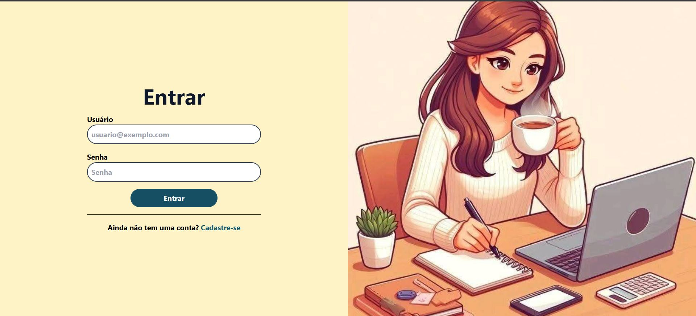
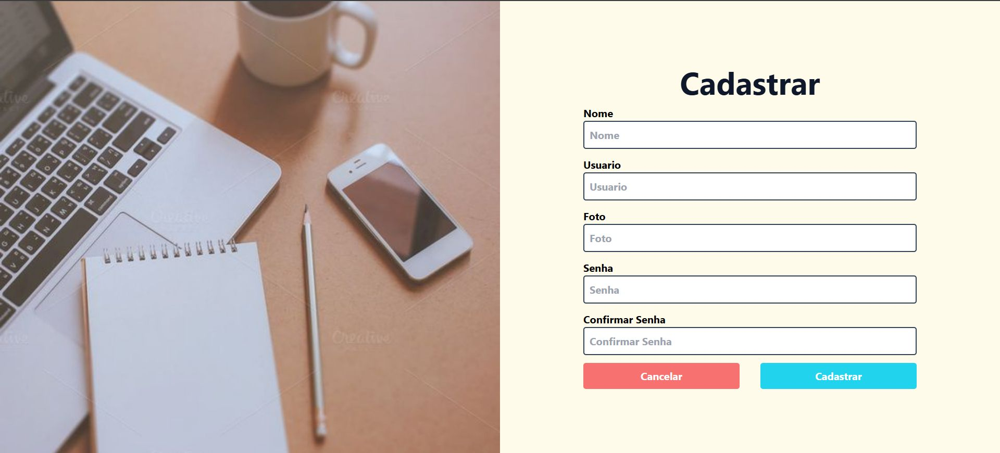
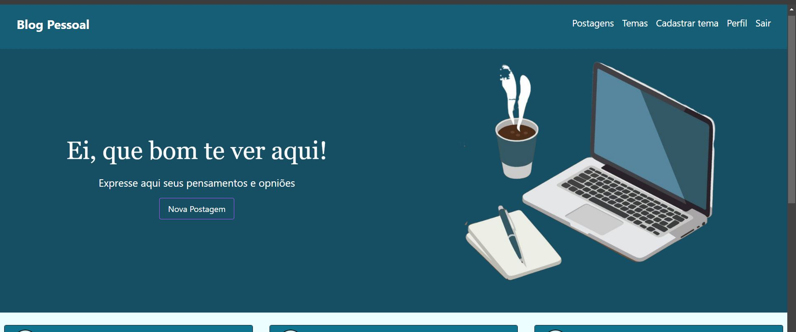
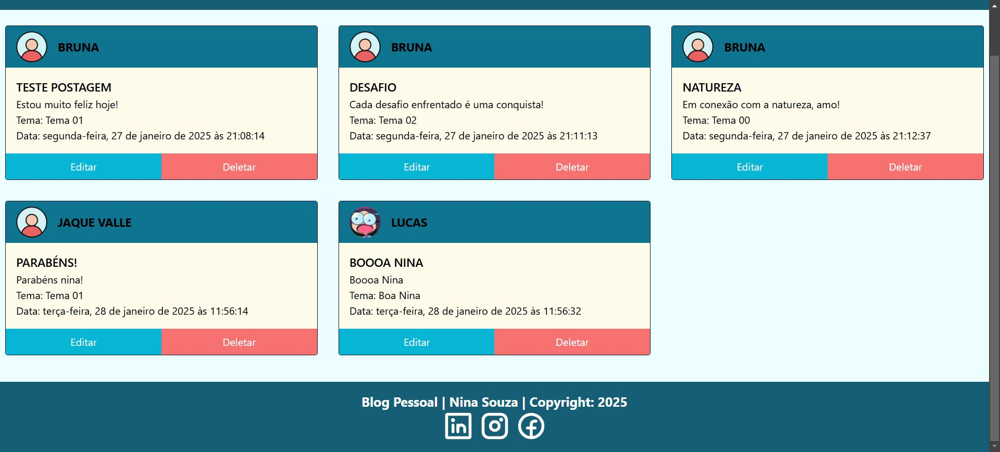

# 💻Blog Pessoal
## Projeto blog pessoal com integração entre frontend e backend!
### Com objetivo do usuário expressar seus pensamentos e opiniões.
### Onde o usuário pode cadastrar um tema, fazer uma postagem, com funções de editar e excluir conforme necessário.

## ⚙️🛠️Tecnologias utilizadas:
### ☑️ Backend: Desenvolvido com Java, Spring Boot, utilizando Spring Security para autenticação e autorização. O deploy foi feito no Render.
### ✅ Frontend: Construído com React, e estilizado com Tailwind CSS para garantir uma interface moderna. O deploy foi feito no Vercel.
### 🤝Integração: A comunicação entre as camadas foi realizada via API RESTful, garantindo uma troca eficiente de informações entre o frontend e o backend.

